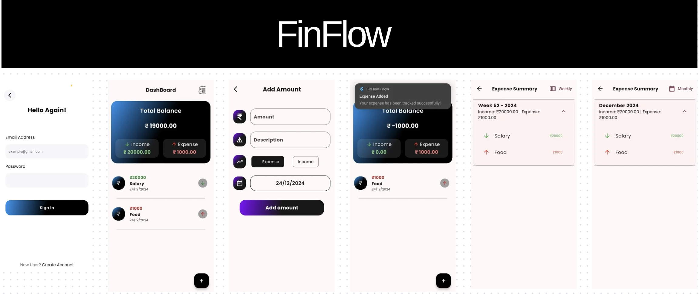

# FinFlow - Personal Finance Management App


<p align="center">
  
</p>

## 📱 Overview

FinFlow is your personal finance companion that helps you track both income and expenses, providing detailed insights into your financial health. With features like balance tracking, periodic reports, and smart notifications, managing your finances has never been easier.

## ✨ Key Features

### 💰 Transaction Management
- **Record Transactions**
  - Firebase Authentication(Login/Signin)
  - Add Income entries
  - Add Expense entries
  - Set transaction date
  - Edit or Delete entries
  - Local Notification Reminders
  - Weekly or Monthly Summary

- **Balance Overview**
  - View total balance
  - Total income summary
  - Total expenses breakdown
  - Real-time balance updates

### 📊 Financial Reports
- **Weekly Analysis**
  - Income vs Expense comparison
  - Category-wise breakdown
  - Visual charts and trends
  - Weekly balance changes

- **Monthly Insights**
  - Detailed monthly summary
  - Category distribution
  - Spending patterns
  - Saving trends

### 🔔 Smart Notifications
- Daily recording reminders
- Custom time notifications
- Balance alerts
- Weekly report notifications

## 🏗️ Technical Architecture

### Data Structure
```dart
class Transaction {
  final String id;
  final double amount;
  final TransactionType type; // Income or Expense
  final String category;
  final DateTime date;
  final String? note;
  final String? imagePath;
}

enum TransactionType {
  income,
  expense
}
```

## 📊 Features Implementation

### 1. Balance Management
```dart
class BalanceState {
  final double totalBalance;
  final double totalIncome;
  final double totalExpenses;
  final List<Transaction> recentTransactions;
}
```

### 2. Reports Generation
```dart
class ReportData {
  final DateTime startDate;
  final DateTime endDate;
  final double periodIncome;
  final double periodExpenses;
  final double netChange;
  final Map<String, double> categoryBreakdown;
}
```

## 🚀 Getting Started

### Prerequisites
1. **Flutter SDK** (3.24.0 or higher)
2. **Dart SDK** (3.2.0 or higher)
3. **Android Studio** or **VS Code**
4. **Git**

### Installation Steps

1. **Clone the Repository**
```bash
git clone https://github.com/yourusername/finflow.git
cd finflow
```

2. **Install Dependencies**
```bash
flutter pub get
```

3. **Configure Notifications**
```dart
// Add to AndroidManifest.xml for Android
<uses-permission android:name="android.permission.RECEIVE_BOOT_COMPLETED"/>
<uses-permission android:name="android.permission.VIBRATE" />
```

## 📦 Dependencies

```yaml
dependencies:
  flutter:
    sdk: flutter
  # State Management
  flutter_bloc: ^8.1.3
  
  # Local Storage
  hive: ^2.2.3
  hive_flutter: ^1.1.0
  
  # Notifications
  flutter_local_notifications: ^9.0.0
  
  # Charts
  fl_chart: ^0.63.0
```

## 💡 Usage Examples

### Adding a Transaction
```dart
// Add Income
await transactionBloc.add(AddTransaction(
  amount: 1000.0,
  type: TransactionType.income,
  category: 'Salary',
  date: DateTime.now(),
));

// Add Expense
await transactionBloc.add(AddTransaction(
  amount: 100.0,
  type: TransactionType.expense,
  category: 'Groceries',
  date: DateTime.now(),
));
```

### Setting Up Notifications
```dart
// Daily reminder
await notificationService.scheduleDailyReminder(
  time: TimeOfDay(hour: 20, minute: 0),
  title: 'Record Your Transactions',
  body: 'Don\'t forget to log your daily transactions!',
);
```

## 📱 App Screens

1. **Home Screen**
   - Total Balance Display
   - Recent Transactions
   - Quick Add Buttons
   - Balance Summary

2. **Add Transaction**
   - Income/Expense Toggle
   - Amount Input
   - Category Selection
   - Image Attachment
   - Notes Field

3. **Reports Screen**
   - Weekly/Monthly Toggle
   - Income vs Expense Charts
   - Category Distribution
   - Transaction History

## 🔍 Key Implementation Details

### 1. Transaction Management
- Double-entry accounting system
- Real-time balance updates
- Category-based organization
- Image storage and compression

### 2. Notification System
- Customizable reminder times
- Daily transaction reminders
- Weekly report notifications
- Balance change alerts

### 3. Reports Generation
- Automated weekly summaries
- Monthly financial reports
- Category-wise analysis
- Trend predictions

## 🔧 Setup Configuration

### Notification Setup
```dart
final FlutterLocalNotificationsPlugin notifications = 
    FlutterLocalNotificationsPlugin();

final initializationSettings = InitializationSettings(
  android: AndroidInitializationSettings('@mipmap/ic_launcher'),
  iOS: IOSInitializationSettings(),
);

await notifications.initialize(initializationSettings);
```

## 🧪 Testing Guidelines

### Key Test Areas
- Transaction calculations
- Balance updates
- Notification scheduling
- Report generation
- Data persistence

## 📈 Future Enhancements

- [ ] Budget planning and tracking
- [ ] Multiple accounts management
- [ ] Export reports to PDF/Excel
- [ ] Cloud backup integration
- [ ] Financial goals tracking

## 🤝 Contributing

We welcome contributions! Please see our [Contributing Guidelines](CONTRIBUTING.md) for details.

## 📄 License

This project is licensed under the MIT License - see the [LICENSE](LICENSE) file for details.

## 📞 Contact

Your Name - dhruvbalchandani1@gmail.com

Project Link: [https://github.com/dhruvx19/finflow](https://github.com/dhruvx19/finflow)

---
Remember to star ⭐ the repo if you find it helpful!
